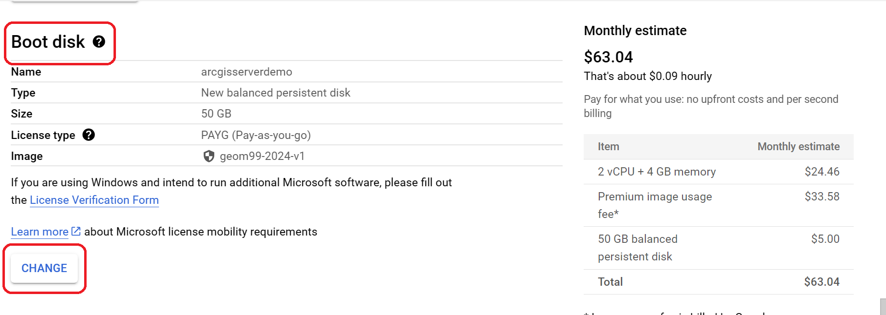

| **Summary Technical Log**                                 |
|-----------------------------------------------------------|

**Task:** Creating an image and logging in on Google Cloud Platform  
**Software/Application:** ArcGIS Server, GCP  
**Goal:** ArcGIS Server on GCP
**Status:** Ended
  
**Time run successfully** 30 min  
**Time expended**         410 min  
**Link to final product** [NA](http://www.com)  
**No attempt** 03 de 03  
  
  
| **Date**              | **Step No**                                   | **Key/Tip** | **Description/Notes** | **Documentation** |
|-----------------------|-----------------------------------------------|-------------|-----------------------|-------------------|
| 2024-02-27 11:30:00   | Step01_Create VM                              | notes       | notes below           | [doc/link](https://www.youtube.com/watch?v=dyFeyBX9jIY)          |
| 2024-02-27 13:20:00   | Step02_Log in the machine                     | notes       | notes below           | [doc/link](https://www.youtube.com/watch?v=dyFeyBX9jIY)          |  
| 2024-02-27 15:57:00   | Step03_Test the machine is running on the web | notes       | notes below           | [doc/link](https://www.youtube.com/watch?v=dyFeyBX9jIY)          |
| 2024-02-27 16:55:00   | Step04_ArcGIS Pro set Server Connection       | notes       | notes below           | [doc/link](https://www.youtube.com/watch?v=dyFeyBX9jIY)          |
| 2024-02-27 17:45:00   | Step05_Stop the Virtual Machine               | notes       | notes below           | [doc/link](https://www.youtube.com/watch?v=dyFeyBX9jIY)          |
| 2024-02-27 18:20:00   | End                                           |

**Results:**  
A virtual machine instance is created in the google cloud console, confirmed that it works (web and connecting it to ArcGIS Pro) and disconnected

**Next steps:**
Create a DNS so that the IP does not change every time the machine stops.

| **Notes for the process**                                |
|-----------------------------------------------------------|

This process starts assuming there are credits in Google Cloud. 
## Step 01_ Create VM (Virtual Machine)
**Virtual Machine:** A virtual machine (VM) is a digital version of a physical computer. Virtual machine software can run programs and operating systems, store data, connect to networks, and do other computing functions, and requires maintenance such as updates and system monitoring. https://cloud.google.com/learn/what-is-a-virtual-machine  
in https://console.cloud.google.com/welcome  
  
  
  
It still doesn't work, first you need to "Enable" Compute Engine API
  
  
      
Now an image will be taken and deployed into this as a virtual machine.  

1. Create instance  

2. In the Create instance windows  
   - Name:  arcgisserverdemo  
   - Region:  us-central1 (Ioma)  
   - Zone:  us-central1-a
   
   - Machine:  
     - Series: E2  
     - Machine type: e2-medium (2 vCFU, 4 GB memory)
   
   - Boot disk: if is linux, need to be changed to windows as follow (**Window is not include in free demo**):

     - Custom Images Tab  
       (+) Source project for images: the project which contain the image, if the image is in a different project, then click CHANGE, after select the project which contain the image, and OK.  
       (+) image: select the image
       (+) select
       
     - **Firewall:** Allow HTTP and HTTPS traffic
     - Create

3. Under Related actions: Set up **firewall rules**

   - create a Firewall Rule

     - Name: flemingrdp444
     - Direction of traffic: Ingress
     - Action on match: Allow

     - Targets: All instances in the network
     - Source filter: iPv4 ranges
     - Source of iPv4 ranges: Enter the external ip for your computer -> restricted or 0.0.0.0/0 -> unrestricted
     - Protocols and ports:  
       (+) TCP: 444  (3389 is default for RDP but is blocked in fleming, 444 will work at fleming)
     - Create

  
4. Setting a GCP Firewall Rule to allow ArcGIS Server Management Ports
4.1 ArcGIS Server management has two ports: 6443 (hhtps) and 6080 (http) 

- click Create Firewall Rule

- Name firewall rule, set the port and click create

4.2 Setting a Windows Firewall Rule to allow ArcGIS Server Management Ports
- *This must be completed on the server itself, not on your local computer*

## Step02_Log in the machine
In the row of the list of VM intances, there is a column called Connect/RDP ▼ > set windows password  
- set the username: Student
       (+) Copy the password in a notepad
  
In the row of the list of VM intances there are two IP
- internal: if you are in Google Facilities in Iowa
- external: if you are in a different place
 
after copy the IP open **Remote Desktop Connection** or the same **mstsc** (Microsoft Terminal Services Client) desktop window application.
- Computer: Paste the IP (:444)
- Click connect
 
- it goes to prompt the user and password (it will popup a message about invalid certificate: YES)

### from Step02_4.2 Setting a Windows Firewall Rule to allow ArcGIS Server Management Ports
before leave the virtual machine finish this step
in the windows application search engine  
 
Select a new rule and set TCP and enter the two ports we are permitting through for ArcGIS Server administration,
6443 and optionally 6080.
 
 
 

## Step03_Test the machine is running on the web
Copy and paste the **External IP** from the list of VM intances on the browser, if you see this, that means the web server is replying now. Also https://**IP** can be tried, it will say is not secure because the certificate, but it will continue.

- https://**IP**/arcgis/rest/services check if the Rest endpoint is running

- https://**IP**/arcgis/manager  
       (+) Username: siteadmin  
       (+) Password:  

## Step04_ArcGIS Pro set Server Connection
Insert > Connection> Add New server conection -> This have to be done everytime publish is wanted, because the External IP of the virual machine intance change everytime the machine is stopped. 
- In Add ArcGIS Server Connection  
       - Server URL: https://**IP**/arcgis/  
       - Username: siteadmin  
       - Password:  
       - Save the log in credential is not neccesary  

**Sign out of the virtual machine**
## Step05_Stop the Virtual Machine
### First Way
In VM intances in the console of google cloud, at the end of the row of the VM intance > ┇ > stop

### Second Way
In the remote desktop > Start Menu > Power > Shutdown

**Note:** Everytime the machine is stopped, and turned on again, the IP will change to get around this read: 
[Create DNS](https://github.com/geolaurajaimes/gislaura/blob/main/a01webdevelopment/w02_duckDNS.md)
