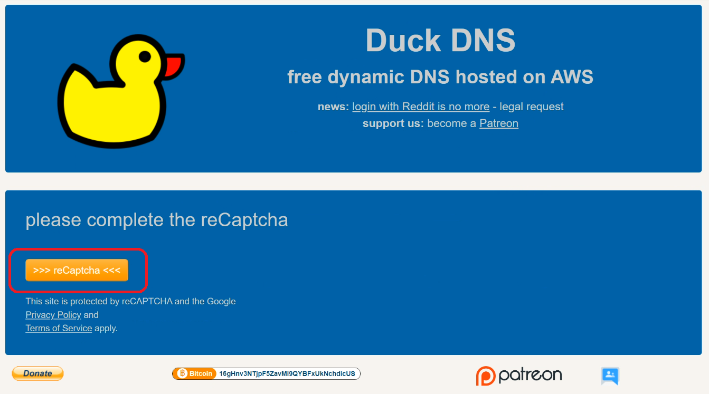

| **Summary**                                       |
|---------------------------------------------------|  

**Task:** Create a Temporary DNS free  
**Software/Application:** https://www.duckdns.org/  
**Goal:** Create a DNS to avoid changing the IP everytime the VM stop in Google Cloud  
**Status:** Ended  
  
**Time run successfully**  h  
**Time expended**         h  
**Link to final product** [NA](http://www.com)  
**No attempt** 01 de 01  
  
  
| **Date**              | **Step No**              | **Key/Tip**                             | **Description/Notes** | **Documentation**                           |
|-----------------------|--------------------------|-----------------------------------------|-----------------------|---------------------------------------------|
| 2024-02-27 19:25:00   | Step01_Create an account | can use a google account                | notes                 | https://www.duckdns.org/                    |
| 2024-02-25 20:34:00   | Step02_Create a domain   | Domain can be update with a new IP      | notes                 | https://www.youtube.com/watch?v=8peq7B8SEYk |  

    
**Results:**                    
 A domain was created

**Next steps:**
Obtain SSL certificate

| **Technical Log notes**                           |
|---------------------------------------------------|

# Step01_Create an account 
Enter in in https://www.duckdns.org/  
Create and account or log in by creating an account or using the account options available  
  

# Step02_Create a domain  
-click en reCaptcha  
  

-Create a domain  
-Copy the External IP from google cloud console and paste it in current ip and click update domain  
  

The new domain will be: **something.duckdns.org** every time the VM stop in Google Cloud, and restart, and recreate the external IP, the IP linked to this new domain can be updated in duckdns but it will no need to be update in server or in other places where the use of the VM is required. 
