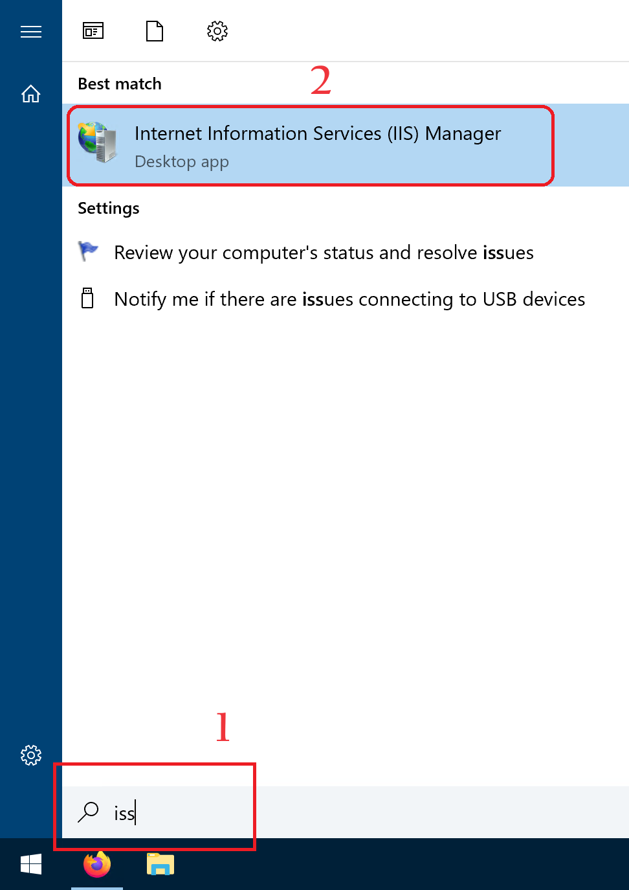
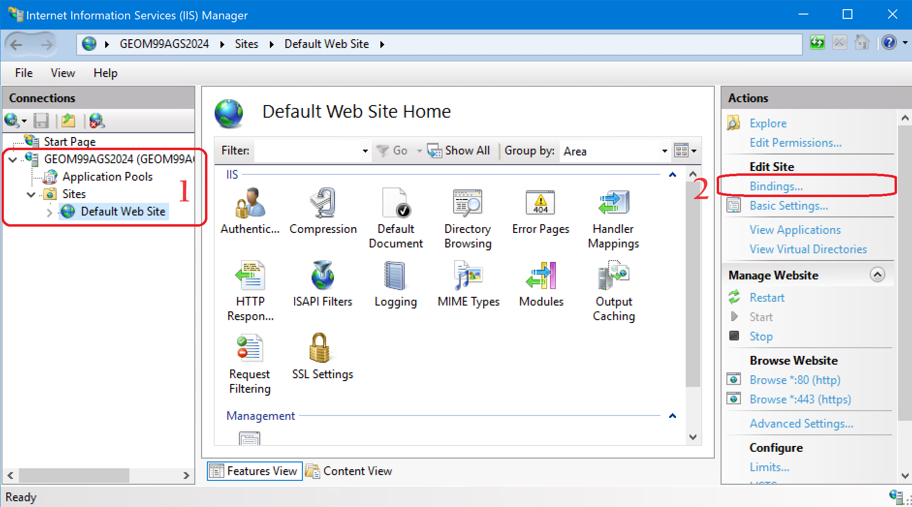
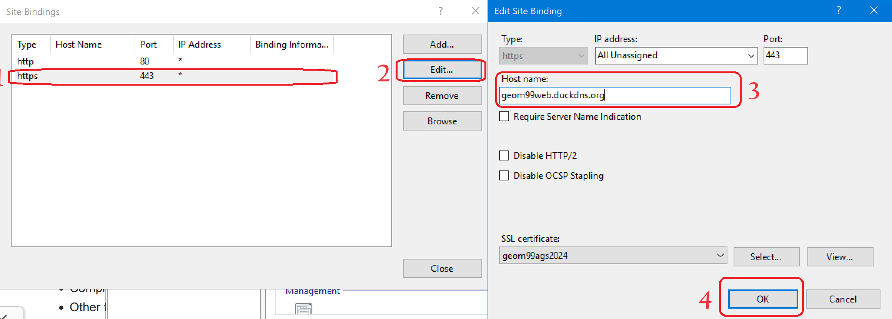
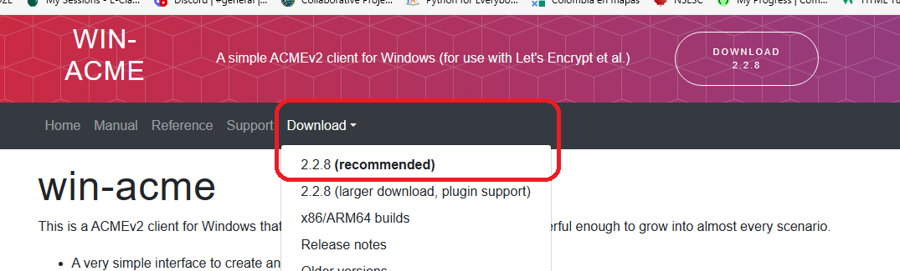
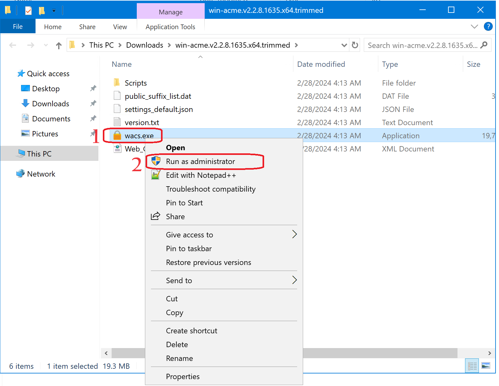

| **Summary**                                       |
|---------------------------------------------------|  

**Task:** Obtain SSL certificate  
**Software/Application:** https://www.duckdns.org/  
**Goal:** Get a certificate for the DNS    
**Status:** Ended  
  
**Time run successfully** 15 min  
**Time expended**         40 min    
**Link to final product** [NA](http://www.com)  
**No attempt** 01 de 01  
  
  
| **Date**              | **Step No**              | **Key/Tip**                             | **Description/Notes** | **Documentation**                           |
|-----------------------|--------------------------|-----------------------------------------|-----------------------|---------------------------------------------|
| 2024-02-27 20:23:00   | Step01_Create an account | can use a google account                | notes                 | https://www.duckdns.org/                    |
| 2024-02-25 19:34:00   | Step02_Create a domain   | Domain can be update with a new IP      | notes                 | https://www.youtube.com/watch?v=8peq7B8SEYk |  
| 2024-02-27 20:00:00   | Ended |
    
**Results:**                    
A certificate was obtain

**Next steps:**
Use the VM of GCP in ArcGIS Server

| **Technical Log notes**                           |
|---------------------------------------------------|

# Step01_Set the workspace
1. Start the VM
2. Update the External IP in DuckDNS
3. Log in the VM using the Remote desktop
# Step02_Define domain host
4. Open the window application Internet Information Services (IIS) Manager

5. Enter to Default Web site > Bindings...

6. in site Binding windows, select https port 443 and click edit, and define the domain created in DuckDNS as host name (something.duckdns.org)

# Step03_Install ACME for Windows
7. Enter to https://www.win-acme.com/
8. Download the WIN-ACME 

9. unzip
8. run as administrator wacs.exe

10. more> run anyway

# Step04_Request certificate
11. Follow the code to set: (options with a * means is a default, you can type the option or enter)
    - Create certificate
    - Against the Default Web Site
    - All bindings
    - Confirm (y/n) the selection
    - Open the terms of servers (Open in default application) - it is not neccessary
    - agree the terms
    - Provide email
    - When the code start again, the window can be closet

12. Then will use the web server to validate is working, such as http and https enabled, and will assign a SSL Certificate
    The certificate can be viewed in the browser. It has an expiration date. 

