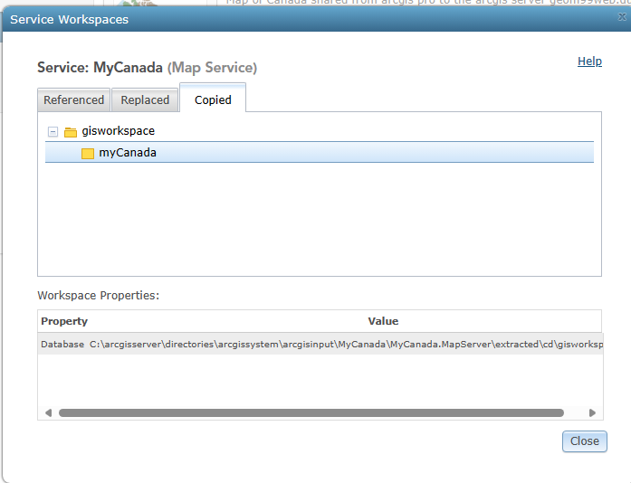

| **Summary Technical Log**                                 |
|-----------------------------------------------------------|

**Task:** Creating an image and logging in on Google Cloud Platform  
**Software/Application:** ArcGIS Server, Google Cloud Platform  
**Goal:** ArcGIS Server on GCP
**Status:** Ended
  
**Time run successfully** 15 min  
**Time expended**         15 min  
**Link to final product**   
**No attempt** 01 de 01  
  
  
| **Date**              | **Step No**                                   | **Key/Tip** | **Description/Notes** | **Documentation** |
|-----------------------|-----------------------------------------------|-------------|-----------------------|-------------------|
| 2024-02-29 11:35:00   | Step01_Publish                                | notes       | notes below           | [doc/link](https://www.youtube.com/watch?v=dyFeyBX9jIY)          |
| 2024-02-29 12:20:00   | End                                           |

**Results:**  
A web map was publish

**Next steps:**
Include the map in a web application.

| **Notes for the process**                                |
|-----------------------------------------------------------|

# Step01_Publish
*Assuming DNS for the ip of the VM and certificate was made*  
*Assuming the map project in ArcGIS Pro is done and ready to be published*
1. Start the VM  

2. Copy the url  

3. update the DNS domain  

4. Test the machine is running in your browser  

5. Test the arcgis server is running  

6. can also login  

7. login as administrator  
   :6443 .../manager  
  

8. start the virtual machine in a remote desktop

9. make a copy of the project data following the same path make it easier but it can be done in a different path

10. the publication will be done from the pc where ArcGIS Pro is install and the project is ready to be published    
    the VM does not have ArcGIS Pro.  
    Conect the server  
    
    
    
12. publish
    
for publish the data can be reference to the vm data path or can be copy  
  
| Map Service:    | myCanada                             | myCanada2                               |
| --------------- | ------------------------------------ | --------------------------------------- |
| Descripción:    | Color                                | Grayscale                               |
|                 | |    |
| Data:           | Copy All Data                        | Reference Registered Data               |
|                 | Data will be copied to this path ⬇   | Means the data in the server has to be specified |
|                 |                                      | reference the data in the validation 24011 fixing |
|                 |                                      |    |  
|                 |                                      | same or different path will be depend or where the data in the VM was storege |  
|                 |                                      |    |   
|                 | |    |
|                 | |    |

now data will be available  

| REST ENDPOINT:  | 
| --------------- | 
|     |  
|     |  
|     |  

--------------------------------------------------------------------------------------------------------------
# URLs myCanada
## REST:
### Color copied data
https://geom99web.duckdns.org/arcgis/rest/services/MyCanada/MyCanada/MapServer
https://geom99web.duckdns.org/arcgis/rest/services/MyCanada/MyCanada/MapServer/0
### grayscale referenced data
https://geom99web.duckdns.org/arcgis/rest/services/MyCanada/MyCanada2/MapServer
https://geom99web.duckdns.org/arcgis/rest/services/MyCanada/MyCanada2/MapServer/0

## arcgis online
Service definition
ID: 6a97371a74d64dfe8fb803244fa06672

### color:
https://fleming.maps.arcgis.com/home/item.html?id=caacfbc3d89246a4bf121a39eac81068
ID: caacfbc3d89246a4bf121a39eac81068
https://fleming.maps.arcgis.com/home/item.html?id=bd76e22bf07c43e0b96bbaafbd839c50

### gray
ID: 4de87c42ed464337ad74f3cd13f0cb64
https://fleming.maps.arcgis.com/home/item.html?id=4de87c42ed464337ad74f3cd13f0cb64
rest item: https://geom99web.duckdns.org/arcgis/rest/services/MyCanada/MyCanada2/MapServer/0

## Create a map with the item id
item id del **mapa**
Service ItemId: caacfbc3d89246a4bf121a39eac81068
https://services1.arcgis.com/pMeXRvgWClLJZr3s/ArcGIS/rest/services/MyCanada/FeatureServer
https://services1.arcgis.com/pMeXRvgWClLJZr3s/ArcGIS/rest/services/MyCanada/FeatureServer/0

*************************************************
# URLs Canada

## CanadaMap publish with data
Canada map created in ArcGIS Pro, shared to geom99web.duckdns.org server as administrator.
Copy all data
it will be shared in arcgis pro
https://geom99web.duckdns.org/arcgis/rest/services/CanadaMap/CanadaMap/MapServer
https://geom99web.duckdns.org/arcgis/rest/services/CanadaMap/CanadaMap/MapServer/0

## CanadaMap2 created in ArcGIS Pro, shared to geom99web.duckdns.org server as administrator.
reference registered data
it will be shared in arcgis pro
https://geom99web.duckdns.org/arcgis/rest/services/CanadaMap/CanadaMap/MapServer
https://geom99web.duckdns.org/arcgis/rest/services/CanadaMap/CanadaMap/MapServer/0

## CanadaMap item id on AGOL
### CanadaMap
https://fleming.maps.arcgis.com/home/item.html?id=86938745e07346edaafbd47c72358ea7
https://geom99web.duckdns.org/arcgis/rest/services/CanadaMap/CanadaMap/MapServer

### CanadaMap2 
https://fleming.maps.arcgis.com/home/item.html?id=7ccc7762a5894e2ca3852f4eed4cef3b
https://geom99web.duckdns.org/arcgis/rest/services/CanadaMap/CanadaMap/MapServer

### layer CanadaMap
https://fleming.maps.arcgis.com/home/item.html?id=372b0b4059f6451b98747eb5c1b7b765
https://geom99web.duckdns.org/arcgis/rest/services/CanadaMap/CanadaMap/MapServer/0

### layer CanadaMap2
https://fleming.maps.arcgis.com/home/item.html?id=df99712d10f34fa9974b6bc96601871f
https://geom99web.duckdns.org/arcgis/rest/services/CanadaMap/CanadaMap/MapServer/0
