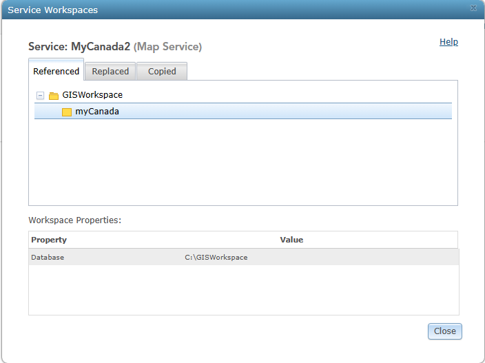

| **Summary Technical Log**                                 |
|-----------------------------------------------------------|

**Task:** Creating an image and logging in on Google Cloud Platform  
**Software/Application:** ArcGIS Server, Google Cloud Platform  
**Goal:** ArcGIS Server on GCP
**Status:** Ended
  
**Time run successfully** 15 min  
**Time expended**         15 min  
**Link to final product** [NA](http://www.com)  
**No attempt** 01 de 01  
  
  
| **Date**              | **Step No**                                   | **Key/Tip** | **Description/Notes** | **Documentation** |
|-----------------------|-----------------------------------------------|-------------|-----------------------|-------------------|
| 2024-02-29 11:35:00   | Step01_Publish                                | notes       | notes below           | [doc/link](https://www.youtube.com/watch?v=dyFeyBX9jIY)          |
| 2024-02-29 12:20:00   | End                                           |

**Results:**  
A web map was publish

**Next steps:**
Include the map in a web application.

| **Notes for the process**                                |
|-----------------------------------------------------------|

# Step01_Publish
*Assuming DNS for the ip of the VM and certificate was made*  
*Assuming the map project in ArcGIS Pro is done and ready to be published*
1. Start the VM  

2. Copy the url  

3. update the DNS domain  

4. Test the machine is running in your browser  

5. Test the arcgis server is running  

6. can also login  

7. login as administrator  
   :6443 .../manager  
  

8. start the virtual machine in a remote desktop

9. make a copy of the project data following the same path make it easier but it can be done in a different path

10. the publication will be done from the pc where ArcGIS Pro is install and the project is ready to be published    
    the VM does not have ArcGIS Pro.  
    Conect the server  
    
    
    
12. publish
    
for publish the data can be reference to the vm data path or can be copy  
  
| Map Service:    | myCanada                             | myCanada2                               |
| --------------- | ------------------------------------ | --------------------------------------- |
| Descripción:    | Color                                | Grayscale                               |
|                 | |    |
| Data:           | Copy All Data                        | Reference Registered Data               |
|                 | Data will be copied to this path ⬇   | Means the data in the server has to be specified |
|                 |                                      | reference the data in the validation 24011 fixing |
|                 |                                      |    |  
|                 |                                      | same or different path will be depend or where the data in the VM was storege |  
|                 |                                      |    |   
|                 | |    |
|                 | |    |

now data will be available  

| REST ENDPOINT:  | 
| --------------- | 
|     |  
|     |  
|     |  
