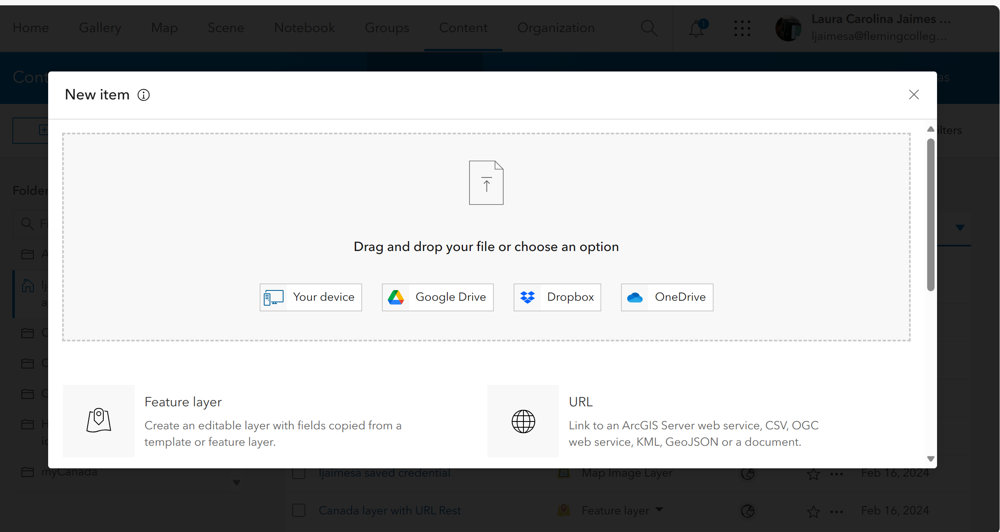
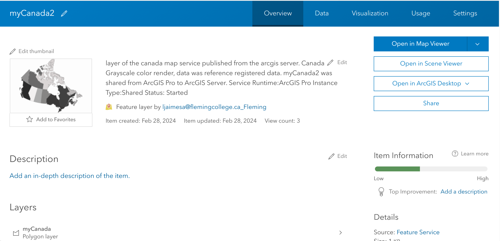
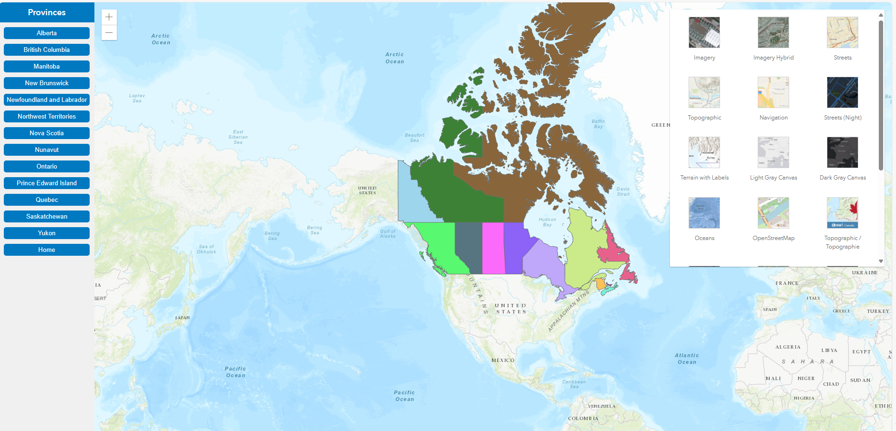
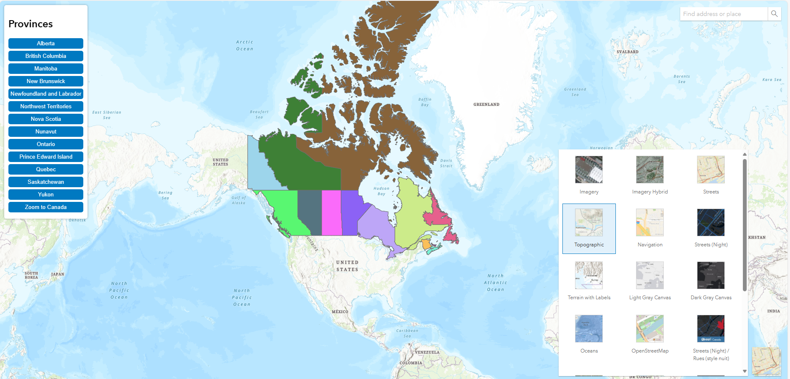

| **Summary Technical Log**                                 |
|-----------------------------------------------------------|

**Task:** Create a web map using the Canada layer publish using VM    
**Software/Application:** ArcGIS Online, Html, ArcGIS API  
**Goal:** ArcGIS Server on GCP
**Status:** Ended
  
**Time run successfully**  120 min  
**Time expended**          163 min  
**Link to final product** [see my map](https://geolaurajaimes.github.io/geom99/myCanadaMapWeb.html)  
**No attempt** 01 de 01  
  
  
| **Date**              | **Step No**                                   | **Key/Tip** | **Description/Notes** | **Documentation** |
|-----------------------|-----------------------------------------------|-------------|-----------------------|-------------------|
| 2024-02-29 15:04:00   | Step01_Create map                             | notes       | notes below           |           |
| 2024-02-29 17:47:00   | End                                           |

**Results:**  
Result

**Next steps:**
nothing

| **Notes for the process**                                |
|-----------------------------------------------------------|

# Step01_Create a map
1. add a new item - URL
  

| **myCanada**                              | **myCanada2**                            |  
|-------------------------------------------|------------------------------------------|  
|   |  |

2. add the URL of the item of ARCGIS Online to a web map on a html using ArcGIS JavaScript API v4
https://geolaurajaimes.github.io/geom99/myCanadaLyr.html  
https://geolaurajaimes.github.io/geom99/myCanadaMapWeb.html  

| **Map**              | **Layer**                                   |  
|-----------------------|-----------------------------------------------|  
|   |  |
