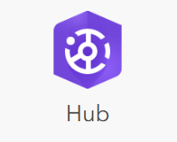
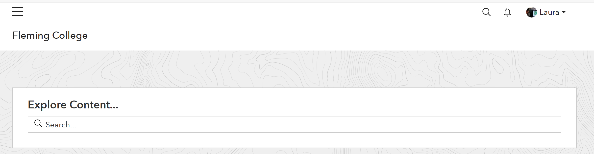

| **Summary Technical Log**                                 |
|-----------------------------------------------------------|

**Task:** Week 9 Checklist - Configurable Solutions Menu     
**Software/Application:**  
    Experience Builder  
    ArcGIS Dashboards  
    Esri StoryMaps  
    Focused Configurable Apps  
    ArcGIS Hub  
    ArcGIS Field Maps  
    Leaflet JavaScript API  
    Geoserver  
    OpenStreetMap  
    qField  
    KoboToolbox  
    OpenLayers  
    Mapbox (pay)  
    Carto y CartoDB (pay)  
    GIS Cloud (pay)  

**Goal:** Get familiar with those Configurable Solutions  
**Status:** Proccess
  
**Time run successfully** xx min  
**Time expended**         50 min  
**Link to final product**   
**No attempt** 01 de 01  
  
  
| **Date**              | **Step No**              | **Documentation** |
|-----------------------|--------------------------|-------------------|
| 2024-03-07 17:35:00   | Experience Builder       | [doc/link](https://experience.arcgis.com/experience/dfdd326f157844d1837f0c183778019b)  |
| 2024-03-07 18:20:00   | Dashboard                | [doc/link](https://fleming.maps.arcgis.com/apps/dashboards/88b233fbbfd34d4499a9628e43f2b1dd)  |
| 2024-03-07 20:25:00   | StoryMap                 | [doc/link](https://storymaps.arcgis.com/stories/3cc73ac95eec43cfa4bc9c7bc70f3415)  |
| 2024-03-07 20:25:00   | StoryMap                 | [doc/link](https://storymaps.arcgis.com/stories/3cc73ac95eec43cfa4bc9c7bc70f3415)  |
| 2024-03-09 18:05:00   | ArcGIS Hub               | [doc/link](https://storymaps.arcgis.com/stories/3cc73ac95eec43cfa4bc9c7bc70f3415)  |
| 2024-03-10 08:10:00   | ArcGIS Field Maps        | [doc/link](https://fleming.maps.arcgis.com/home/item.html?id=232cb7cccd6241abb9ca6d08c7cb9d04)  |
| 2024-03-10 10:35:00   | Leaflet JavaScript API   | [doc/link]()  |
| 2024-03-10 13:11:00   | Geoserver                | [doc/link]()  |
| 2024-03-10 15:01:00   | OpenStreetMap            | [doc/link]()  |
| 2024-03-10 17:00:00   | qField                   | [doc/link]()  |
| 2024-03-10 19:32:00   | OpenLayers               | [doc/link]()  |
| 0000-00-00 00:00:00   | Mapbox (pay)             | [doc/link]()  |
| 0000-00-00 00:00:00   | Carto y CartoDB (pay)    | [doc/link]()  |
| 2024-03-10 21:35:00   | GIS Cloud (pay)          | [doc/link]()  |
| 2024-03-07 23:55:00   | End                      | 

**Results:**  

**Next steps:**
none.

| **Notes for the process**                                |
|-----------------------------------------------------------|

# Experience Builder  
Two option: te application can be made using the experience website, then "publish"  
or developers edition of Experience Builder where you can install the configuration tool locally.  

1. Open the ArcGIS Experience Builder application.

2. Create a new project.

3. Choose the canvas type you want to use. In this case, select "Launchpad".

4. Change the title of the project as needed.

5. Center the canvas to fit your screen.

6. Load the necessary data for your application.

7. Select a previously created web map and web scene.

8. Press "Done" to continue.

9. In the content section, select the data source for the application and choose the maps (2D and 3D in this case).

10. Create a new page for your application.

11. Change the default page name to "Home" and the new page to "Map". Make sure the "Lock Layout" button is off to add widgets.

12. In the "+" symbol at the bottom right corner, select and drag the widgets you want to add to the canvas.

13. Add the "Map" widget to insert a map and the "Menu" widget to have a navigation menu to move from one page to another.

14. Switch to mobile design mode and customize the design as desired, including colors, fonts, widgets, etc.

15. Publish

---

# Dashboard
ArcGIS Dashboards are interactive visualizations presenting location-based data, facilitating data management and communication through graphs and maps.  

1. Open the dashboard application.
  
2. Click on "Create Dashboard".

3. Assign a title, tags, summary, and the folder where you want to save it in ArcGIS Online.

4. In "Add Element", choose any of the available options.

6. You can insert a map.

7. Tables and charts.

8. Each time you insert, the application will highlight different areas for you to choose where to insert your new element.

9. When you're ready, you can preview it.

---

# Story Map

1. Open the StoryMaps application. 
2. Click on "New Story" and choose to start from scratch or with a template. 
3. Customize the title, description, and upload an image or video for the cover. 
4. Choose a layout and theme for the cover image. 
5. Insert various elements such as texts, hyperlink buttons, etc., to convey your message. 
6. Add media like maps, videos, images, etc. 
7. Include more immersive elements. 
8. Select from multiple layout options. 
9. Configure and include all necessary information. 
10. Edit until you achieve the desired result. 
11. Finally, publish your story. 

# ArcGIS Hub
1. From ArcGIS Online I clicked on the ‘Apps button’ and selected ‘Hub.’

2. I do not have this application available

3. the provided video is very easy to follow:
Introducing ArcGIS Hub: https://www.youtube.com/watch?v=XMXryMx8zDo
Customizing the Theme: https://www.youtube.com/watch?v=ERdhPw7kIaE
Configuring your Hub: https://www.youtube.com/watch?v=L5r6x2DxsLA

# Field Maps Designer
1. From ArcGIS Online I clicked on the ‘Apps button’ and selected ‘Field Maps Designer.

2. Later, I selected a web map that I had previously created called ‘New Fake Tree map

3. Then, I clicked on the ‘Forms’ tab

4. I added a combo box called Condition, with a field length of 50

5. After that, I created a list of values, including four categories (Excellent, Good, Poor, and Very Poor)

6. Later, I saved changes at the top right button (next to properties)

7. After that, I added a switch field called Fruit Tree, which allows me to select whether the tree bears fruits

8. Later, I added a layer containing the location of other trees (Fake trees layer)

9. To ensure that the surveyor includes the trees within the municipality of Kawartha Lakes, I used the city's boundary as a geofence.
I clicked on the 'geofence' tab and, later, on the 'add geofence' button

10. I set a location alert every time the surveyor is out of the municipality. The results of this Field map can be seen on the web map called ‘New Fake Tree map

# Leaflet JavaScript API

# 

