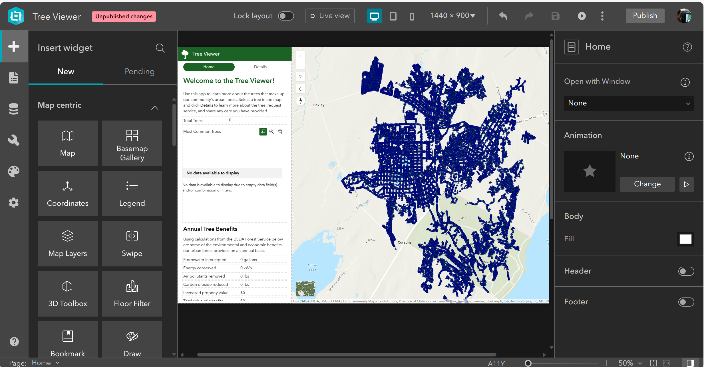

| **Summary Technical Log**                                 |
|-----------------------------------------------------------|

**Goal:** Get familiar with Tree Management Configurable Solution  
**Status:** Proccess
  
**Time run successfully** 90 min  
**Time expended**         50 min  
**Link to final product**   
**No attempt** 01 de 01  

| **Date**              | **Step No**              | **Documentation** |
|-----------------------|--------------------------|-------------------|
| 2024-03-12 11:25:00   | Familiar with tree app   | very complex      |
| 2024-03-12 16:05:00   | End                      |

**Results:**  

**Next steps:**
none.

| **Notes for the process**                                |
|-----------------------------------------------------------|

# Tree Management  
1. open solutions in arcgis online

2. select the Tree Management application

3. read overview and watch explanatory video, click deploy now

4. a Tree Management element is created

5. The application already contains several layers and elements and other applications in a default structure, with surveys field maps, 2D views and 3D views, Experience Builder,

6. Tree viewer is an Experience Builder that can be modified, it has an inventory of trees, layers and elements can be replaced

7. has an Esri hub which is a collection of rows where you can put, arrange one or more elements

8. Esri hub is one with many alternatives for elements such as statistics

9. or you can include maps and scenes, images, text, etc.

10. The surveys are already configured but can be modified according to need

11. Each of these elements is an item in arcgis online

