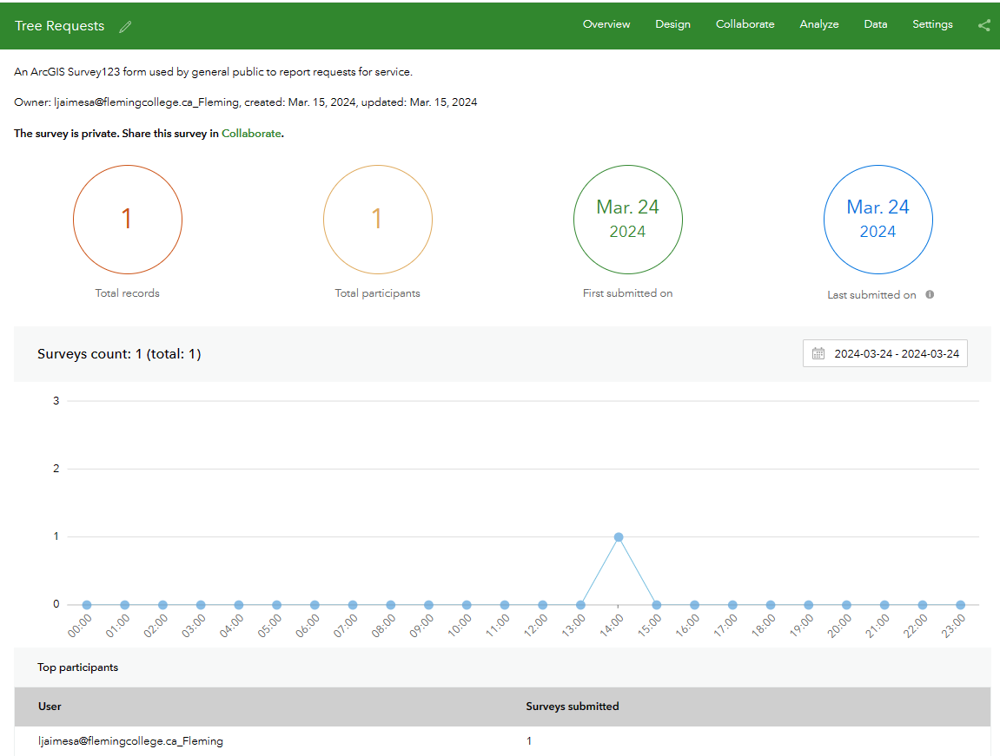

| **Summary Technical Log**                                 |
|-----------------------------------------------------------|

**Goal:** browsing Tree Management solutions II    
**Status:** In Proccess  

| **Date**              | **Step No**              | **Documentation** |
|-----------------------|--------------------------|-------------------|
| 2024-03-24 13:01:00   | Tree management          | https://doc.arcgis.com/en/arcgis-solutions/latest/reference/introduction-to-tree-management.htm |
| 2024-03-24 14:07:00   | End                      |

**Link to this solution:**  
[item](https://fleming.maps.arcgis.com/home/item.html?id=90d73ff2cc4848ae8a5660b6741650d0)  
[Hub](https://tree-management-3-fleming.hub.arcgis.com/)    
[ArcGIS_Pro] (https://fleming.maps.arcgis.com/home/item.html?id=8b7aa5160b5f432b96445900c5a4e361)  
[RequestSurvey](https://survey123.arcgis.com/share/d8bfbd6471db46c3ac2df221014c1fc1?portalUrl=https://Fleming.maps.arcgis.com)  

**Next steps:**
Edit every item.

| **Notes for the process**                                |
|-----------------------------------------------------------|

# Tree Management

This is the second attempt, the first time many files were seen and I started in disarray and it seemed unmanageable to me that I had edited and that I had not
Starting from the beginning, creating a new application I started editing from in order  
Starting with the description page, thumbnail, etc.  
  
Now I continue with each item on the list, the first is an arcgis pro file, which can be downloaded and updated  
  
The description and so on can also be edited, I think it is important to keep track of what is being edited and what its function is within the scheme.  
  
The aprx file can be downloaded and edited as needed in arcgis pro and updated back into the schematic  
  
The next item in the solution is the surveys. This survey is for a service requirement.  
  
It can be edited or viewed. The item details can be modified  
  
see what the already published survey looks like and can also be completed  
  
The survey can be opened for editing  
  
Some statistics related to the quantity and density of surveys can also be analyzed, as well as who conducted them and on what date.  
  
