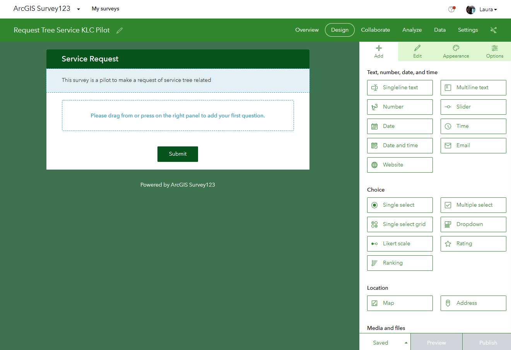

| **Summary Technical Log**                                 |
|-----------------------------------------------------------|

**Goal:** Get familiar with collection data solutions 
**Status:** In Proccess
**Time expended**         000    

| **Date**              | **Step No**              | **Link output** |
|-----------------------|--------------------------|-------------------|
| 2024-03-15 13:00:00   | ArcGIS Workforce         | https://fleming.maps.arcgis.com/apps/workforce/projects/13b23d4f37834ed9b7aa03f814078f0e/dispatch/assignments |
| 2024-03-15 14:32:00   | End                      |
| 2024-03-20 9:00:00   | KoboToolbox              | https://ee.kobotoolbox.org/x/BAYRNgeG |
| 2024-03-20 10:42:00   | End                      |
| 2024-03-22 11:30:00   | Survey123                | https://fleming.maps.arcgis.com/home/item.html?id=03ba8d8b73cf4cb781eb03333f09bbf0 |
| 2024-03-22 12:37:00   | End                      |
| 2024-03-24 16:18:00   | qfield                   |      |
| 2024-00-00 00:00:00   | End                      |
| 2024-00-00 00:00:00   | field maps               |       |
| 2024-00-00 00:00:00   | End                      |

**Next steps:**
Make a website to open the survey and also, display the data.

| **Notes for the process**                                |
|-----------------------------------------------------------|

# ArcGIS Workforce
Tutorial: Link: https://doc.arcgis.com/en/workforce/android-phone/help/create-your-first-project.htm
## Create a project in the Workforce web app
Open Workforce web app from the app launcher in ArcGIS Online
   
Click Create Project.
  
Give a name an summary to the project  
  
### Project Setup
note:  
  
Define Types of assignment  
  
Define roles: Dispatchers create and assign assignments and mobile workers have assigned assignments in your organization or partnered collaboration from other organization.
Tip: Add yourself as a mobile worker so you can test your project in the mobile app before deploying it.
Tip: mobile workers list .csv can be upload add worker from file.
  
### Customize map  
Click in dispatcher/Worker map to modified/add/remove/update  
  
You can upload layers to the dispatcher and then those layers will be available and can be put on the mobile worker map, you can add and edit the layers, customize feature pop-ups and labels. And also, create offline map area  
  
  
  
  
  
  
  
  
### Integrate other Esri apps
Navigator is integrated by default, and Field Maps, Collector, Explorer, and Survey123 can be integrated.
  
-	Integrate ArcGIS Field Maps with existing maps or by defaults.
  
-	Integrate with the project or specific assignment types.
 
## Test the project
Open the project

Create example assignments.

Test the task updated and upload properly

----------------------------------------------------------------------
# KoboToolbox
Link: https://doc.arcgis.com/en/workforce/android-phone/help/create-your-first-project.htm  
This is the interface once you register on the page  
  
In this link there is the documentation for the use of this solution  
 https://support.kobotoolbox.org/getting-started.html  
  
For the current purpose, matters concerning data collection will be reviewed.  
  
### New Project  
Click create new project  
  
It can be created from scratch, use a template that you have already configured, upload an Excel from your local drive or from the internet with a url  
  
Creating the project from scratch will ask you to give it a name and other information, then create project  
  
Initially the project will be empty  
  
### Add questions  
Ask your first question  
  
A list of options is presented for the type of response to be answered in the survey question
Multiple choice, number, location, ranking, photo  
  
Each option will give you more options if applicable, such as the option to select one  
  
You can also see the preview of how the survey is going or click save to update the changes made or you can also simply click the plus sign to add more questions  
  
Previous will show you a version of the final presentation of the survey  
  
Add another question such as Location, you will be able to see in the preview how you can select the location by clicking or searching for the address or entering the coordinates, answering the preview will give you an idea of the experience but you do not enter data  
  
With sustained control you can select the questions you want to group  
  
You can add more questions within the group or outside the group, this will also allow you to collapse the questions within the group, the group name can also be edited  
  
### Questions with special settings  
Create 1. A note, then create questions 2 and 3 and group them  
Open group settings  
  
In the group configuration options it will allow you to add a button to repeat the question if necessary, this will allow the user to enter more than one answer to this question in the same form, note that there are other configuration options, such as making the answer mandatory  
  
The preview will show you what a question of this type looks like.  
  
You can also ask a question only if the previous question meets a requirement  
For example, only show fruit trees if the user says they have fruit.  
  
In the configuration of the second question, in the Skip logic option you can put a condition  
  
This condition must add the previous field that determines whether this question will be shown or not and can have several logic operators in this case it is only = yes, if the condition is met, the question we are configuring will be shown  
  
It will look like a cascading question.  
  
You can configure that if a question is answered in a certain way, it asks another series of questions and skips them, but to avoid having to configure each question individually by putting the condition in the group  
  
Under FORM, you can deploy the survey and choose how you will collect the data online, offline, both, ability to receive multiple surveys or single surveys. You can also deploy the survey using an embedded html link, so that the survey is answered on your web page  
   
Below data, you can see the data of the surveys carried out, there are several options such as viewing the report, you can see graphs of the results, table of collected data, gallery in case the survey includes videos, photos, etc., and you can also download the data or view it on a map.  
   
----------------------------------------------------------------------  
# Survey123
Tutorial: https://www.youtube.com/watch?v=ROv7cDdgYLo  
Select the Survey123 app  
  
This application is not to collect data, it is to design the survey, click Create new survey  
  
The options are: Blank survey, Template survey and Survey123 Connect, in this case Blank survey was selected  
  
You can change the interface color, the project title and the survey title, you can also configure the final submited message  
  
This survey is initially empty, but in the design tab you can start adding questions to the survey, each control in the right panel has a question type control, each question will be a field  
  
An example is the single line of text, you can configure the number of characters, if it is a mandatory question to fill out.  
  
You can use single choice to choose one option and give or not give him the option of another  
If you leave one of the answers selected, it will be marked by default, but the respondent can change it  
The batch edit option is for the case where the options listed will be many, you can copy and paste them  
  
Well, use multiline for additional observations, this is important for cases that do not fit the options, you can limit the number of characters, in this case you can configure so that the other field only appears if the other box was checked  
  
Multiple choice grid is filled out in a similar way but can ask several related questions, in this case the batch option was used to enter the options.  

The map option is useful to give a geographic location to the request so that it can be addressed appropriately. You can also ask for permission to access the location.  
  
If the options are many, dropdown is a good alternative and can be set with autocomplete, which will allow you to quickly find  
The email and photo options are also very useful.  
  
The group option allows questions to be grouped together, perhaps useful in a long survey or a sectional survey  
  
### observation:
When publishing the survey, it was uploaded for a longer time than normal, as no changes were saved at any time during the process, the survey was completely lost.

# qfield

# field maps
