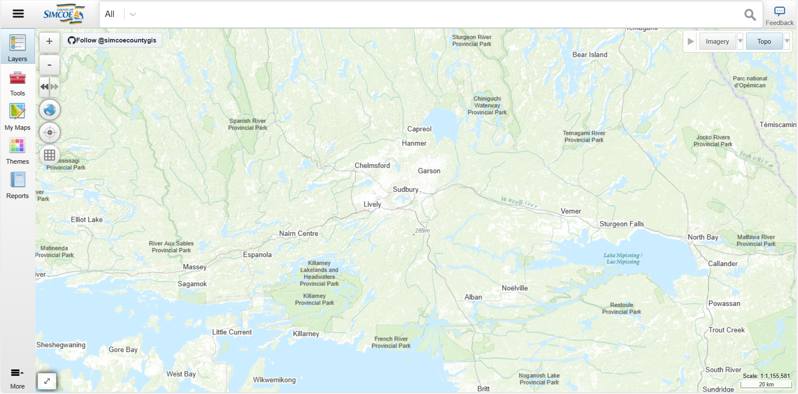

| **Summary Technical Log**                                 |
|-----------------------------------------------------------|

**Goal:** browsing solutions   
**Status:** In Proccess  

| **Date**              | **Step No**              | **Documentation** |
|-----------------------|--------------------------|-------------------|
| 2024-03-23 22:00:00   | Simcoe                   |                   |
| 2024-03-15 22:42:00   | End                      |
| 2024-00-00 00:00:00   | xxxxxxxxxx               |                   |
| 2024-00-00 00:00:00   | End                      |

**Link to this solution:**  
[Simcoe](#Simcoe)  

**Next steps:**
Try to replicate something similar.

| **Notes for the process**                                |
|-----------------------------------------------------------|

# Simcoe
This is the web site the [Simcoe]( https://opengis.simcoe.ca/public/)  
  
The + and – keys are used to zoom, or the mouse wheel, you can also zoom to a certain extent with held shift  
  
On the left side the balloon will take you to the center, the icon below the balloon will take you to your location and the box will draw a grid.   
Also the menu button has the thematic layers available and some tools to interact with the map  
  
There are also several basemaps available  
  
You can search by place/address or topic.  
  
You can select the available layers in Layers  
  
There are several tools to interact with the map under the tools button  
  
Themes are applications related to the theme  
  
For example, in real states, it has information classified by property type and photos  
  
